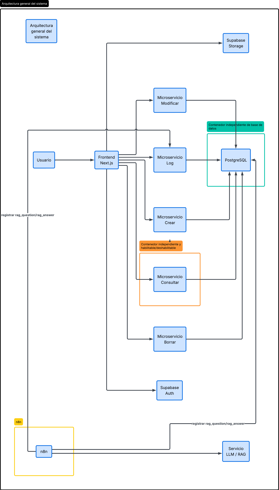
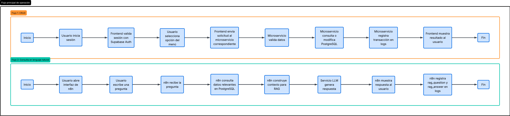

# Documento de Diseño
## Sistema de Gestión de Datos Personales

## 1. Introducción

Este documento describe el diseño del sistema de Gestión de Datos Personales desarrollado como trabajo final de DS2. El sistema permite registrar, modificar, consultar y eliminar información de personas, registrar todas las transacciones en un log y realizar consultas en lenguaje natural mediante n8n aplicando el patrón RAG, de acuerdo con los requerimientos definidos para el proyecto  .

El diseño propuesto busca cumplir la rúbrica utilizando una arquitectura modular, simple y mantenible. Se prioriza una solución clara y académicamente defendible, evitando complejidad innecesaria en la base de datos, los servicios y la infraestructura .

## 2. Objetivo del sistema

El objetivo del sistema es gestionar datos personales mediante una interfaz web autenticada, permitiendo realizar operaciones CRUD sobre los registros y manteniendo trazabilidad completa de cada transacción realizada .

Adicionalmente, el sistema debe ofrecer una opción de consulta en lenguaje natural implementada en n8n con apoyo de RAG, de forma que el usuario pueda hacer preguntas sobre la información almacenada y recibir respuestas basadas en los datos registrados .

## 3. Alcance

El sistema cubre las siguientes funcionalidades principales:

- Autenticación mediante un proveedor reconocido.
- Creación de registros de personas.
- Modificación de registros existentes.
- Eliminación de registros.
- Consulta de personas por número de documento.
- Consulta de logs por tipo, documento y fecha.
- Consulta en lenguaje natural mediante n8n y RAG .

El alcance también incluye las validaciones obligatorias del formulario, el almacenamiento de fotos mediante Supabase Storage y el despliegue en contenedores de los componentes principales del sistema .

## 4. Requerimientos funcionales

El sistema debe cumplir los siguientes requerimientos funcionales:

- Utilizar un sistema de autenticación reconocido .
- Permitir crear, modificar, borrar y consultar registros de personas .
- Usar el número de documento como llave principal de búsqueda .
- Registrar todas las transacciones en un log .
- Permitir consulta de log por tipo y documento, y por fecha de transacción .
- Implementar consulta en lenguaje natural usando n8n y RAG .
- Registrar en el log las preguntas y respuestas generadas por la consulta en lenguaje natural .

## 5. Requerimientos no funcionales

El sistema debe cumplir los siguientes requerimientos no funcionales:

- La aplicación debe desplegarse en contenedores .
- La base de datos debe estar en un contenedor independiente .
- La opción de consultar debe estar en un contenedor independiente y poder habilitarse o deshabilitarse según demanda .
- La solución debe ser mantenible y comprensible para un contexto académico.
- Las validaciones deben existir en frontend y backend.
- La arquitectura debe evitar overengineering innecesario.

## 6. Decisiones de diseño

Para mantener el proyecto simple y al mismo tiempo cumplir la rúbrica, se tomaron las siguientes decisiones:

- Utilizar Next.js para el frontend por su facilidad para construir formularios, rutas y componentes reutilizables.
- Utilizar Supabase Auth para autenticación, evitando desarrollar un sistema de login propio.
- Utilizar Supabase Storage para las fotos, guardando únicamente la URL o path en la base de datos.
- Utilizar una sola base de datos PostgreSQL, en lugar de varias bases por microservicio, para reducir complejidad innecesaria.
- Separar cada opción principal del menú en un microservicio independiente.
- Mantener el servicio de consultar en un contenedor separado para cumplir el requerimiento explícito.
- Utilizar n8n como entorno de consulta en lenguaje natural, tal como lo exige la consigna .

Estas decisiones permiten una solución modular y coherente con el alcance del proyecto, sin introducir componentes avanzados que no aportan valor directo a la entrega.

## 7. Arquitectura general

La arquitectura del sistema está compuesta por los siguientes elementos:

- Frontend en Next.js.
- Supabase Auth para autenticación.
- Supabase Storage para almacenamiento de fotos.
- Microservicio Crear.
- Microservicio Modificar.
- Microservicio Borrar.
- Microservicio Consultar.
- Microservicio Log.
- Base de datos PostgreSQL.
- n8n para la consulta en lenguaje natural.
- Integración con un servicio LLM para la respuesta basada en RAG.

El frontend centraliza la interacción del usuario con el sistema. Los microservicios manejan la lógica de negocio y el acceso a la base de datos. PostgreSQL almacena la información de personas y el log de transacciones. n8n consulta la base de datos, construye el contexto y coordina la respuesta en lenguaje natural .

### Diagrama



## 8. Descripción de módulos

### 8.1 Frontend

El frontend es la interfaz principal del sistema. Permite autenticación, navegación y operación de las funcionalidades del menú principal .

Sus responsabilidades son:

- Mostrar la interfaz de login.
- Presentar el menú principal.
- Mostrar formularios y vistas de consulta.
- Aplicar validaciones del lado del cliente.
- Consumir los microservicios.
- Subir fotos a Supabase Storage.
- Redirigir o enlazar a la interfaz de n8n.

### 8.2 Microservicio Crear

Este servicio recibe la información de una nueva persona, valida los datos, inserta el registro en la base de datos y registra la transacción correspondiente en el log .

### 8.3 Microservicio Modificar

Este servicio actualiza los datos de una persona existente a partir del número de documento, validando nuevamente la información antes de guardar cambios y registrando la operación en el log .

### 8.4 Microservicio Borrar

Este servicio elimina registros de personas utilizando el número de documento como identificador principal y deja trazabilidad de la operación en la tabla de logs .

### 8.5 Microservicio Consultar

Este servicio obtiene información de personas registradas, utilizando el número de documento como criterio de búsqueda principal .

Debe vivir en un contenedor independiente y poder habilitarse o deshabilitarse según demanda, tal como lo exige la rúbrica .

### 8.6 Microservicio Log

Este servicio permite consultar la auditoría del sistema. Debe filtrar registros por tipo de transacción, número de documento y fecha de transacción .

### 8.7 n8n y RAG

n8n se utiliza como entorno de consulta en lenguaje natural. Allí se presenta la interfaz para que el usuario formule preguntas y reciba respuestas basadas en los datos almacenados .

El flujo general consiste en recibir la pregunta, recuperar información relevante desde PostgreSQL, construir contexto y obtener una respuesta a través de un modelo de lenguaje. Tanto la pregunta como la respuesta deben quedar registradas en el log .

## 9. Modelo de datos

La base de datos está diseñada para mantenerse simple y centrada en las necesidades del proyecto. Se definieron dos tablas principales:

- `personas`
- `logs`

### 9.1 Tabla personas

Esta tabla almacena la información principal capturada por el formulario del sistema .

Campos principales:

- `numero_documento`
- `tipo_documento`
- `primer_nombre`
- `segundo_nombre`
- `apellidos`
- `fecha_nacimiento`
- `genero`
- `correo_electronico`
- `celular`
- `foto_url`
- `created_at`
- `updated_at`

El campo `numero_documento` se utiliza como clave principal, ya que la consigna define el documento como la llave de búsqueda principal de los registros .

### 9.2 Tabla logs

Esta tabla registra la actividad del sistema y permite auditoría posterior .

Campos principales:

- `id`
- `numero_documento`
- `tipo_transaccion`
- `descripcion`
- `user_id`
- `user_email`
- `fecha_transaccion`

Los tipos de transacción considerados son:

- `create`
- `update`
- `delete`
- `query`
- `rag_question`
- `rag_answer`

La tabla incluye índices por tipo de transacción, número de documento y fecha de transacción para facilitar la consulta de logs .

## 10. Validaciones

Las validaciones exigidas por la consigna deben aplicarse en frontend y backend, y en algunos casos reforzarse en base de datos mediante restricciones .

Las validaciones requeridas son:

- Tipo de documento: lista con dos valores, Tarjeta de identidad y Cédula .
- Número de documento: solo numérico y máximo 10 caracteres .
- Primer nombre: no numérico y máximo 30 caracteres .
- Segundo nombre: no numérico y máximo 30 caracteres .
- Apellidos: no numérico y máximo 60 caracteres .
- Fecha de nacimiento: selección mediante calendario o ingreso en formato válido .
- Género: Masculino, Femenino, No binario y Prefiero no reportar .
- Correo electrónico: formato válido .
- Celular: solo numérico y exactamente 10 caracteres .
- Foto: tamaño máximo de 2 MB .

La validación del tamaño de la foto no se implementa en PostgreSQL, ya que el archivo se almacena en Supabase Storage y la base de datos solo guarda la ruta o URL del recurso.

## 11. Flujos principales

### 11.1 Flujo de autenticación

1. El usuario accede al sistema.
2. El frontend redirige al proceso de autenticación con Supabase Auth.
3. El usuario inicia sesión.
4. El frontend obtiene la sesión y habilita el acceso a las funcionalidades del sistema.

### 11.2 Flujo de creación de persona

1. El usuario abre la opción Crear Personas.
2. El frontend muestra el formulario y valida los datos.
3. Si la foto es válida, se sube a Supabase Storage.
4. El frontend envía la información al microservicio Crear.
5. El microservicio valida nuevamente los datos.
6. El microservicio inserta el registro en la tabla `personas`.
7. El microservicio registra la transacción `create` en la tabla `logs`.
8. El frontend informa el resultado al usuario.

### 11.3 Flujo de modificación

1. El usuario busca el registro por número de documento.
2. El frontend carga la información actual.
3. El usuario modifica los campos permitidos.
4. El frontend envía los cambios al microservicio Modificar.
5. El microservicio actualiza la información.
6. El microservicio registra la transacción `update` en el log.

### 11.4 Flujo de eliminación

1. El usuario ingresa el número de documento.
2. El frontend solicita la eliminación.
3. El microservicio Borrar elimina el registro si existe.
4. El microservicio registra la transacción `delete`.

### 11.5 Flujo de consulta

1. El usuario ingresa el número de documento.
2. El frontend envía la consulta al microservicio Consultar.
3. El microservicio recupera la información desde PostgreSQL.
4. El microservicio registra la transacción `query`.
5. El frontend muestra el resultado.

### 11.6 Flujo de consulta de log

1. El usuario accede a la vista de logs.
2. El frontend envía filtros de tipo, documento o fecha.
3. El microservicio Log consulta la tabla `logs`.
4. El frontend presenta los resultados filtrados.

### 11.7 Flujo de consulta en lenguaje natural

1. El usuario accede a la interfaz de n8n.
2. El usuario escribe una pregunta en lenguaje natural.
3. n8n recibe la pregunta.
4. n8n consulta PostgreSQL para recuperar información relevante.
5. n8n construye el contexto para la respuesta.
6. El modelo de lenguaje genera una respuesta.
7. n8n muestra la respuesta al usuario.
8. n8n registra `rag_question` y `rag_answer` en la tabla de logs .

### Diagrama 



## 12. Integraciones externas

### Supabase Auth

Se utiliza para autenticación con proveedor reconocido, cumpliendo el requerimiento de seguridad de acceso al sistema .

### Supabase Storage

Se utiliza para almacenar las fotos de las personas. En la base de datos solo se conserva la referencia al archivo mediante URL o path.

### n8n

Se utiliza para la implementación de la consulta en lenguaje natural y para la orquestación del flujo RAG, tal como lo solicita la consigna .

### Servicio LLM

Se utiliza como componente de generación de respuesta dentro del flujo RAG.

## 13. Despliegue

El sistema está diseñado para ejecutarse mediante contenedores, coordinados con Docker Compose .

Contenedores principales:

- `frontend`
- `postgres`
- `create-person`
- `update-person`
- `delete-person`
- `query-person`
- `logs`
- `n8n`

El contenedor `postgres` es independiente, y el contenedor `query-person` se mantiene separado del resto para cumplir el requerimiento de habilitación y deshabilitación según demanda .

## 14. Organización del repositorio

La estructura general del repositorio se organiza de la siguiente forma:

```text
people-management/
├── 1-documentation/
├── database/
├── frontend/
├── infra/
├── n8n/
├── services/
├── .gitignore
└── README.md
```

Esta organización permite separar documentación, frontend, base de datos, infraestructura, flujos de n8n y microservicios, manteniendo el proyecto claro y fácil de evolucionar.

## 15. Riesgos y limitaciones

El proyecto está diseñado para un contexto académico, por lo que no busca resolver problemas de alta escalabilidad o arquitecturas distribuidas complejas.

Las principales limitaciones consideradas son:

- Se utiliza una sola base de datos para simplificar la implementación.
- El rendimiento de la consulta en lenguaje natural dependerá de la calidad y consistencia de los datos almacenados.
- La arquitectura de microservicios se mantiene funcional y simple, sin incorporar componentes adicionales como colas, gateways o múltiples bases de datos.

## 16. Conclusión

El diseño propuesto permite cumplir los requerimientos del trabajo final mediante una arquitectura modular, simple y técnicamente coherente .

La solución separa responsabilidades entre frontend, microservicios, base de datos, auditoría e integración con n8n, y al mismo tiempo evita complejidad innecesaria, lo que la hace adecuada para el alcance académico del proyecto.